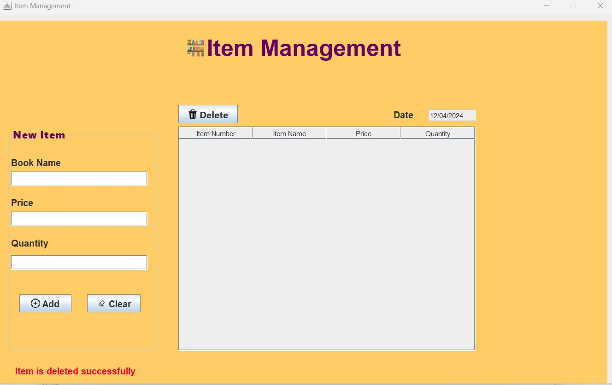

# BookShopGUI
Book Shop GUI application using Java. This project made to teach students how we can make GUI using Java Swing.

## Table of Contents

- [Project Overview](#project-overview)
- [Getting Started](#getting-started)
    - [Prerequisites](#prerequisites)
- [Project Description](#project-description)

## Project Overview
The Books Shop Management System is a Java application built to assist users to handle daily
 operations more effectively. 
This system simplify the core tasks like managing orders, inventory control, payment processing,
 and customer information management, making all these task accessible even to users with limited technical skills.

## Getting Started

### Prerequisites
The project requrires any Java version >=8, and it is made by netbeans Palette to create GUI by drag and drop.

### GUI Project Description

This section describes the main functionalities in the book shop management system.

## Order Management

The system allows order creation, so users can quickly select items, specify quantities, and make orders. 
Orders can be modified or canceled as needed, with each order status (New, In Progress, Completed, Canceled).
Automatic total calculations reduce the risk of billing errors, ensuring accuracy for each order.

## Item Management

Managers can easily add, update, or delete items in the inventory. Item quantities are tracked, with low-stock alerts to prevent shortages and maintain service continuity.

## Customer Management

The application keeps customer details, including names, loyalty points, and order history.
Loyalty points are updated, which helps in building customer relationships by recognizing the mostly visited customers.
Customer data makes it possible for staff to provide a more personalized service, by reviewing the previous orders and preferences, the shop can create special services in the future.

## Payment Processing

The system supports cash and card payments, offering flexibility to customers. For cash payments, the system calculates and displays change automatically which minimizes errors.

For card payment, customer data is securely processed to ensure privacy and safety (CVV displayed hidden as password in our GUI).In addition, every payment is linked to an order.

